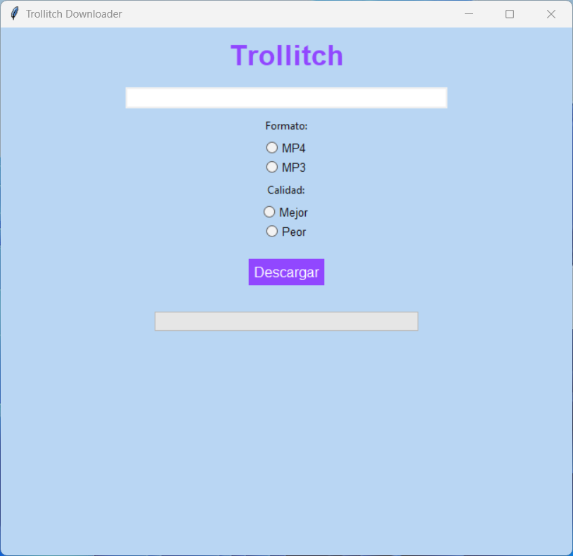

# TROLLITCH

## Descripción

Trollitch es una aplicación de escritorio diseñada para descargar transmisiones en directo desde Twitch en formatos MP4 y MP3. La aplicación utiliza `yt-dlp` para gestionar las descargas y `Tkinter` para ofrecer una interfaz gráfica sencilla e intuitiva, facilitando a los usuarios la elección del formato y la calidad de la descarga.

## Características

- Descarga transmisiones en directo de Twitch en formatos MP4 o MP3.
- Interfaz gráfica amigable desarrollada con `Tkinter`.
- Selección de calidad de descarga: mejor o peor disponible.
- Barra de progreso visual para monitorear el estado de la descarga.
- Compatible con la conversión automática a MP3 utilizando `FFmpeg`.

## Requisitos

Para ejecutar este proyecto, necesitas tener instalados los siguientes componentes:

- Python 3.6 o superior
- Paquetes Python:
  - `yt-dlp`
  - `tk`
- [FFmpeg](https://ffmpeg.org/download.html) (necesario para la conversión de audio y video).

## Instalación

1. Clona este repositorio:
   ```bash
   git clone https://github.com/MikeTrollYT/Trollitch-ConvertidorDeTwitch.git
   cd Trollitch-ConvertidorDeTwitch
2. Instala las dependencias del proyecto:
   ```bash
   pip install -r requirements.txt
3. Asegúrate de tener ffmpeg instalado y disponible en el PATH de tu sistema operativo. [Guía de instalación de FFmpeg](https://ffmpeg.org/download.html)

## Verificar la Instalación de FFmpeg

Para asegurarte de que ffmpeg está instalado y configurado correctamente, puedes usar el script de prueba `prueba.py`.
1. Ejecuta el script con el siguiente comando:
   ```bash
   python prueba.py
2. Si el script descarga correctamente el archivo de prueba y no muestra errores, entonces ffmpeg está instalado y configurado correctamente.

## Uso

1. Ejecuta la aplicación:
   ```bash
   python main.py
2. Introduce la URL del directo de Twitch en el campo de texto.
3. Selecciona el formato de salida (MP4 o MP3).
4. Selecciona la calidad de descarga (Mejor o Peor).
5. Haz clic en el botón "Descargar". La barra de progreso se actualizará conforme avance la descarga.
6. Los archivos se guardarán en la misma carpeta donde se ejecuta el programa.

## Capturas de Pantalla

<div style="text-align: center;">
  
</div>

## Contribuciones

Las contribuciones son bienvenidas. Por favor, sigue los siguientes pasos:
1. Haz un fork del repositorio.
2. Crea una nueva rama (git checkout -b feature/nueva-funcionalidad).
3. Realiza tus cambios y haz commit (git commit -am 'Añadir nueva funcionalidad').
4. Haz push a la rama (git push origin feature/nueva-funcionalidad).
5. Abre un Pull Request.

## Licencia

Este proyecto está licenciado bajo la Licencia MIT. Para más detalles, consulta el archivo `LICENSE`.

## Agradecimientos

- [yt-dlp](https://github.com/yt-dlp/yt-dlp) - Herramienta utilizada para la descarga y conversión de streams.
- [FFmpeg](https://www.ffmpeg.org) - Biblioteca esencial para la conversión de formatos de audio y video.
